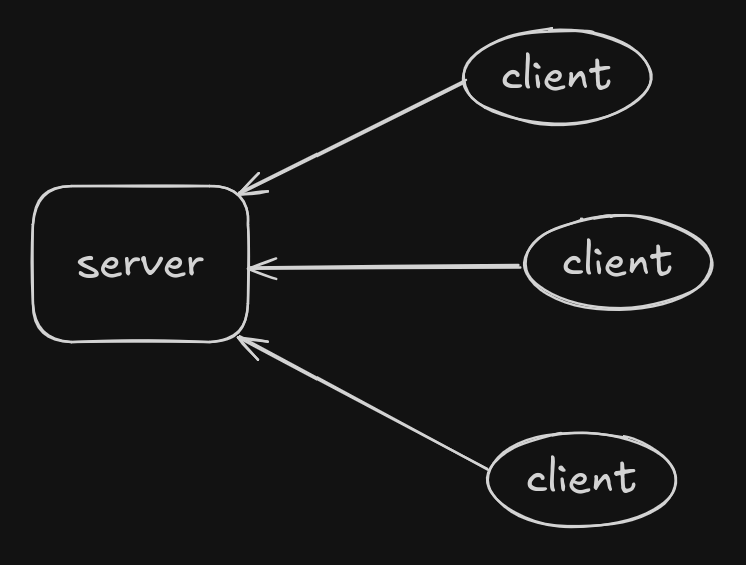

# auctionrs

## Goals
- Create a client-server system for an auction network.
- The centralized server instance will be the entity resposnsible for keeping the data and managing bidding at auctions.
- Users are allowed to post their products and bid in other user's auctions.
- Ultimately, the system should correctly handle a big amount of users simultaneously bidding in products, with real-time updates of the values.

## Development
I will keep a record with the progress of the development of the tool. The idea is to start small, with a single user and no parallelism or APIs, so we can track progress and add features when necessary.

### Idea

We want to create a client-server following the image example. The idea is for clients to interact through the server e.g. some client publishes an item and others can bid on it, but all these actions must happen through the server. In order to run the project we will need at least 2 processes: one for the server and one for the client. At this point I'm not sure if we'll have to restrt to REST APIs but initially some sort of IPC mechanism will ahve to exist for the communciation between client and server.

Since we need two executables, we would need at least two crates. However, I believe in the future the client and the server will have their own modules to provide functionality, so it seems better to separate each service in a package. For this v1 we'll be playing around with the file system to provide permanent storage of information. I want this start not to rely on standard REST API practices like already providing a docker file which starts all services with endpoints that communicate through HTTP or whatever.

Lets start developing the client application. The user should start it and the client (now referring to the tool) should stay on until the user decides to shut it down. Initially we'll hardcode a single user, whom can interact with the client through the terminal. At any given moment, the user should be rpesented with a menu of options. Choosing one can result in an action and the display of another menu (or the same). The user can traverse the menus by selecting the options. This represents the state of the menu component, we can visualize that in the image below. Actions on a given state might move the user around, changing the available options. A choice doesn't necessarily change user-related data on the client, it can simply request functionality to the server.

Even though the user choices are not known at compile-time, the possible paths between menu states are. The menu has to hold the options available for a user during 

